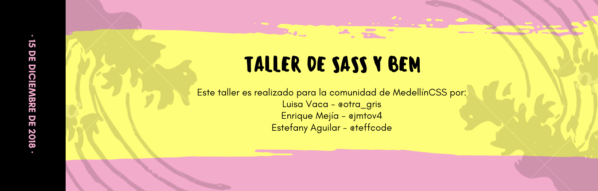
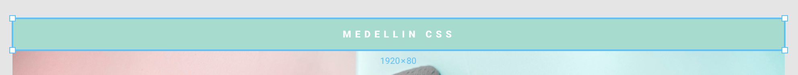
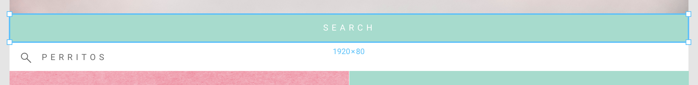
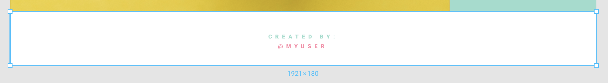

## ¿ Qué haremos ?

Haremos una Landing Page tanto para Web como para Mobile usando SASS y BEM.

## ¿ Qué debemos hacer para comenzar ?

1. Debes tener instalado Git en tu computador.
2. Clonar este repositorio. Nos puedes preguntar si tienes dudas de cómo hacer este paso.
3. Abrir tu editor de código favorito: Visual Studio Code, Atom, Webstorm...
4. Abrir este repositorio en tu editor de código.
5. Escuchar atentamente las indicaciones posteriores. Haremos todo en conjunto, así que debemos esperar a que todos estemos en este paso.

# Comencemos con nuestra Landing Page !

1. [Introducción a SASS](#1-introducción-a-sass)
2. [Introducción a BEM](#2-introducción-a-bem)
3. [Después de clonar el repositorio...](#3-después-de-clonar-el-repositorio)
4. [Conozcamos la estructura de nuestra Landing Page](#4-conozcamos-la-estructura-de-nuestra-landing-page)
5. [Definición de elementos](#5-definición-de-elementos)
6. [Instalación de SASS](#6-instalación-de-sass)
7. [Variables: Paleta de colores y fuentes](#7-variables-paleta-de-colores-y-fuentes)
8. [Navbar](#8-navbar)
9. [Header](#9-header)
13. [Footer](#13-footer)

## 1. Introducción a SASS (Syntactically Awesome StyleSheets)

SASS es un preprocesador de CSS y nos permite escribir CSS con unas pequeñas modificaciones: podemos hacer variables, extender estilos de otras clases, hacer anidamientos, utilizar condicionales, entre otros. 

Aquí te compartimos algunos recursos:

* Documentación oficial: https://sass-lang.com/
* Cheatsheet: https://devhints.io/sass

## 2. Introducción a BEM (Block, Element, Modifier)

* Documentación: https://en.bem.info/methodology/quick-start/

## 3. Después de clonar el repositorio...

Después de clonar el repositorio encontrarás dos carpetas: inicial y final. Tú comenzarás a escribir código en el `index.html` que dejamos para ti en la carpeta inicial. Y porsupuesto, en la carpeta final está el resultado al que debemos llegar.

## 4. Conozcamos la estructura de nuestra Landing Page

Aquí te presentamos la estructura de nuestra Landing Page. Para este caso, escogimos una página de animales pero tú puedes hacerla del tema que quieras: motos, carros, maquillaje, ropa, fitness... e inclusive, tu propia página web. 

* ## Landing Page | Diseño Web

> Mockup Link: https://goo.gl/Qbngyz


* ## Landing Page | Diseño Móvil

> Mockup Link: https://goo.gl/gGkwDq


## 5. Definición de elementos

Para comenzar a maquetar nuestra Landing Page es importante poder reconocer los elementos que allí se encuentran. Es decir, si tiene navbar, header, secciones, imágenes, footer, etc.

* ## Definición de elementos: Landing Page | Diseño Web

* ## Definición de elementos: Landing Page | Diseño Móvil

## 6. Instalación de SASS 

Lo primero que debes saber es que *no* puedes insertar directamente un archivo `.scss` en un archivo `.html`.

¿Por qué? 

Porque SASS al ser un preprocesador de CSS3 y no es soportado en los navegadores web.

Entonces los pasos a seguir son: 

* Instalación de SASS en tu computador con npm: `npm install -g sass`
> Nota: Puedes mirar otras opciones de instalación aquí: https://sass-lang.com/install

* Escribir en tu consola: `sass --watch tu-ruta/sass-workshop/initial/styles.scss tu-ruta/sass-workshop/initial/styles/index.css`
> Nota: "tu-ruta" es el lugar en tu computador en donde clonaste el repositorio. Un ejemplo puede ser: /Users/PepitaPerez/Documentos/... 

* Notarás que se crea un archivo `styles.css.map` 

## 7. Variables: Paleta de colores y fuentes

Las variables en SASS son un camino para almacenar información y poder reutilizarla. 

En nuetro caso, la paleta de colores es: 

* Verde: #99DDCC
* Rosado: #FA91A7
* Amarillo: #D9E540
* Blanco: #FFF

y, la fuente que usaremos se llama: Roboto. 

> Nota: Recuerda que puedes escoger los colores y las fuentes que desees. 

Lo que haremos para definir estas *variables* en nuestro archivo `styles.scss` es escribir lo siguiente:

```
$green: #99DDCC;
$pink: #FA91A7;
$yellow: #D9E540;
$white: #FFF;
$font-arial: arial;
```

## 8. Navbar 

* Imagen del mockup:



Podemos notar que nuestro Navbar debe ocupar todo el ancho de nuestra página (tanto en web como en mobile), un largo de 80px y que además tiene un texto en mayúscula y centrado. Así que:

* En el archivo HTML escribiremos lo siguiente:

```
<nav class="navbar">Medellín CSS</nav>
```

* En el archivo SCSS escribiremos lo siguiente:

```
.navbar {
  background-color: $green;
  color: $white;
  width: 100%;
  height: 80px;
  text-transform: uppercase;
  font-family: $font-arial;
  font-size: 18px;
  font-weight: bold;
  letter-spacing: 5px;
  display: flex;
  align-items: center;
  justify-content: center;
}
```
Puedes notar que tenemos: `font-family`, `font-size`, `font-weight` y con SASS podemos escribir eso así:
```
font: {
    family: $font-arial;
    size: 18px;
    weight: bold;
}
```
Así que nuestra clase `.navbar` quedaría:
```
.navbar {
  background-color: $green;
  color: $white;
  width: 100%;
  height: 80px;
  text-transform: uppercase;
  letter-spacing: 5px;
  display: flex;
  align-items: center;
  justify-content: center;
  font: {
    family: $font-arial;
    size: 18px;
    weight: bold;
  }
}
```

## 9. Header 


## 10. Search 



## 11. Sections | Diseño Web

## 12. Sections | Diseño Móvil

## 13. Footer 

